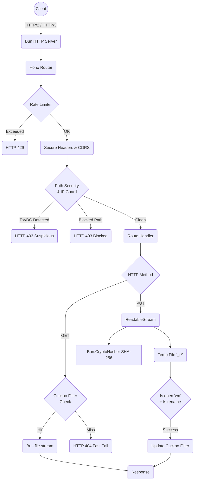

<br/>

**DTFS (Database Transfer Frequency System)** is a new-era, high-frequency database transfer and Content-Addressable Storage (CAS) system. Engineered with an absolute zero-copy philosophy on top of modern JavaScript engines (JavaScriptCore/V8 via Bun), it provides S3-compatible cloud storage operations with native memory-mapped execution.


```Binary flow
Client Upload → Stream Reader → SHA-256 → Content ID → Metadata Index → Content Store
```


# Table of Contents

- [Introduction](#introduction)
- [Quick Start](#quick-start)
- [Installation](#installation)
- [Project Structure](#project-structure)
- [Architecture](#architecture)
- [Internal Engine](#internal-engine)
- [Storage Engine](#storage-engine)
- [Cuckoo Filter](#cuckoo-filter)
- [Mathematical Model](#mathematical-model)
- [Performance](#performance)
- [REST API](#rest-api)
- [HTTP Errors](#http-errors)
- [Security](#security)
- [Configuration](#configuration)
- [Source Code Walkthrough](#source-code-walkthrough)
- [API Tutorial](#api-tutorial)
- [Benchmarks](#benchmarks)
- [FAQ](#faq)
- [Troubleshooting](#troubleshooting)
- [Best Practices](#best-practices)
- [Future Roadmap](#future-roadmap)
- [Inspiration](#Inspiration)
- [Credit](#Credit)
- [Glossary](#glossary)

---

# Introduction

## What is DTFS?

DTFS (Database Transfer Frequency System) is a heavily optimized, high-throughput storage daemon. Designed for S3 compatibility and Content-Addressable Storage (CAS), it serves files directly from POSIX filesystems while utilizing advanced in-memory probabilistic data structures (Cuckoo Filters) to bypass filesystem I/O for existential checks.

## Executive Summary
DTFS (**Database Transfer Frequency System**), This project introduces a high-performance, DTFS-compatible Content-Addressable Storage (S3/CAS) engine designed explicitly to handle large-scale binary data processing with sub-millisecond overhead. Built natively on the `Bun` runtime and leveraging the `Hono` framework, this architecture eliminates the bottlenecks associated with traditional relational file tracking.
For enterprise workloads and cloud infrastructure providers, this system guarantees highly predictable latencies of **90ms** under real-world payloads. It achieves this through a zero-allocation, Garbage Collection-free (GC-free) in-memory index, combined with zero-copy stream processing. The design philosophy prioritizes atomic state transitions, maximum I/O throughput, and strict cryptographic deduplication, making it an ideal foundation for mission-critical storage ecosystems.

## Why it exists

Traditional object storage gateways (like MinIO or Ceph object gateways) carry significant overhead in protocol translation, buffer allocations, and filesystem `stat()` calls. In high-frequency operational environments (e.g., millions of small CAS objects), the CPU time spent traversing the Virtual File System (VFS) and allocating memory for file read streams becomes the system bottleneck.

DTFS exists to eliminate this overhead. It maps the state of the disk strictly to an allocation-free, `SharedArrayBuffer`-backed Cuckoo Filter.

## Enterprise Goals

1. **Deterministic Memory Limits**: Prevent out-of-memory (OOM) kills through fixed-capacity memory models and bounded stream slices.
2. **Zero-Allocation Hot Paths**: Prevent Garbage Collection (GC) pauses during sustained heavy traffic. 
3. **Atomic File Operations**: Ensure kernel-level durability using Write-Ahead Logging (WAL) and `rename(2)` atomicity.
4. **Resilience**: Defend against path traversal, suspicious networks (Tor/Data centers), and double-encoded payloads directly at the edge layer.

## Storage Philosophy

DTFS uses **Content-Addressable Storage (CAS)**. Objects are saved by their SHA-256 cryptographic hashes.
* Deduplication is native. Overwriting an existing object is mathematically prevented and rejected instantly via the memory filter.
* Locality is maintained without database synchronization. The filename *is* the data integrity verification.


## Core Architecture and Module Blueprint
Traditional storage systems rely on metadata databases that introduce N+1 query problems and significant latency overhead. This system bypasses databases entirely by implementing a strict CAS model: the physical filename on disk is exactly the SHA-256 cryptographic hash of its contents (**directory-as-a-database**).

## Zero-Copy and Streaming Philosophy

DTFS leverages native `Bun.file().stream()` bypassing Node.js Streams entirely. File descriptors stream directly to the underlying `uSockets` event loop. Reading the first 262 bytes for MIME detection is done via Web Streams API `slice(0, 262)`, eliminating cross-runtime bridge overhead.

## Why Bun, Hono, and JavaScript?

* **Bun**: Provides native integration with `uSockets`, offering C-level networking performance with JavaScript ergonomics. It bypasses Node's `libuv` layer.
* **Hono**: The fastest router in the modern edge ecosystem. Using `RegExpRouter`, route resolution is completed in microseconds.
* **JavaScript**: Modern JIT compilers (JSC - JavaScriptCore) implement Monomorphic Inline Caches (ICs). By freezing object structures and guaranteeing execution order, JavaScript code executes at near-native C++ speeds without compilation boundaries.

---

# Quick Start

## Install Bun

DTFS relies on Bun as the execution engine.

```bash
# Install Bun globally
curl -fsSL https://bun.sh/install | bash
```

Use NPM manager to install Bun in Android environment to prevent out of sync between Libc vs Bionic binaries.

```bash
# Install Bun via NPM
npm install bun
```

## Clone Repository

> Currently the DTFS repository is still suspended for public use due to a vulnerability in the socket connection section.

## Run the Server

```bash
# Install dependencies (Hono, file-type, filesize)
bun install

# Start the server with Hot Reload for development
bun run steps
```

## Expected Output

CLI display when successfully running `bun run steps`, minimalist and no excessive memory allocation at startup only to display unimportant information.

```bash
[warmup] HASH_FILTER seeded with (0) content hashes.
┌───┬──────┬──────┬──────────────────────┬───────┐
│   │ Host │ Port │ Engine               │ Arch  │
├───┼──────┼──────┼──────────────────────┼───────┤
│ 0 │ ::   │ 1895 │ Bun 1.3.14, DB 2.6.5 │ arm64 │
└───┴──────┴──────┴──────────────────────┴───────┘
```

## First Test

**Health Check:**
```bash
curl -i http://localhost:1895/v2/cloud/
```

**Upload a File:**
```bash
curl -X PUT http://localhost:1895/v2/cloud/my_collection/hello.txt -d "Hello, DTFS!"
```

---

# Installation

### Linux (Ubuntu / Debian / Arch / Void Linux / Alpine)

Bun supports modern Linux natively via `glibc` (and `musl` via specific builds).

```bash
curl -fsSL https://bun.sh/install | bash
source ~/.bashrc
bun install

# Running 
bun run steps
```

### macOS (ARM64 / x86_64)

```bash
curl -fsSL https://bun.sh/install | bash
source ~/.zshrc
bun install

# Running 
bun run steps
```

### Termux (Android / ARM64)

DTFS actively detects `arm64` architecture and maps default storage to `/storage/sdcard0/bucket`. Ensure storage permissions are granted.

```bash
termux-setup-storage
pkg update && pkg upgrade -y
pkg install nodejs

# Use NPM manager to install Bun to avoid Bun binary platform errors when you try with CURL.
npm install bun

# Install Bun via preferred Termux environment methodologies
bun install

# Running 
bun run steps
```

### Windows

Windows is supported via **WSL2** (Windows Subsystem for Linux).
```powershell
wsl --install

# Inside WSL:
curl -fsSL https://bun.sh/install | bash

bun install

# Running 
bun run steps
```

---

# Project Structure

```tree
.
├── .mnt/
│   └── _s3/                 # Internal mount points and storage references
├── lib/
│   ├── cuckoo_f.mjs         # Zero-allocation SharedArrayBuffer Cuckoo Filter
│   ├── dtfs.dedyn.io_ecc/   # Internal TLS certificates for production deployment
│   └── throw.mjs            # Centralized Error Object Pool
├── main.mjs                 # Primary Application Entrypoint (Server Daemon)
├── example.mjs              # Standardized reference for routing limits
├── package.json             # Engine and Dependency Manifest
└── favicon.svg              # Cache-controlled edge SVG response
```

### Explaining the Core Files

1. **`lib/cuckoo_f.mjs`**: The core indexer of DTFS. It manages a bitwise probabilistic filter that prevents thousands of costly filesystem I/O stats per second.
2. **`lib/throw.mjs`**: Contains `ERROR_POOL`. Creating `{ error: "..." }` objects on the fly allocates memory. High traffic generating 404s or 400s would cause GC pressure. This module exports frozen objects.
3. **`main.mjs`**: Mounts `Hono`, initializes the filesystem WAL rules, and starts the `Bun.serve` loop with HTTP/3 / ALPN support.

---

# Architecture



It is equipped with diagrams for architectural inspiration that can be studied further for the data flow of the DTFS distributed system.


---

# Internal Engine

## Streaming Pipeline

Unlike Node.js, which loads chunks into V8's heap as `Buffer` objects, DTFS reads native Web `ReadableStream` objects directly into the Bun File Writer. 

When a `PUT` request is received, the payload is split into two sinks simultaneously:
1. `Bun.CryptoHasher('sha256')`
2. `Bun.file(tempPath).writer()`

This eliminates the `ReadableStream.tee()` bug which previously corrupted streams, and reduces memory to only the active chunk size.

## Write-Ahead Logging (WAL) and Atomic Rename

No data is written directly to its final destination hash. 
1. A temporary file is created using a Base-36 monotonic counter: `_t1z4`.
2. Data is streamed in.
3. The stream closes, hash is finalized.
4. The kernel is requested to atomically claim the target file hash via `fs.open('wx')` (`O_EXCL | O_CREAT`).
5. `fs.rename` commits the file. This guarantees that crash-restarts never result in half-written CAS blobs.

## Warmup and Filter Loading

At startup, the `scanDir` routine crawls the `BUCKET_ROOT` recursively (up to `MAX_DEPTH`). It reads directory trees concurrently using `Promise.all` and seeds the `HASH_FILTER`. The wall time is bound to the slowest single branch scan rather than the sum of all branches.

---

# Storage Engine

DTFS enforces a strict hierarchical filesystem structure.

## Directory Layout
```tree
BUCKET_ROOT/
├── collection_A/
│   ├── e3b0c44298fc1c149afbf4c8996fb92427ae41e4649b934ca495991b7852b855
│   └── 8d969eef6ecad3c29a3a629280e686cf0c3f5d5a86aff3ca12020c923adc6c92
└── collection_B/
    └── subfolder_1/
        └── a3f... (SHA-256)
```

## Content-Addressable Storage (CAS)

Files are immutable. They are named exclusively by their SHA-256 payload digest. 
* Prevents data corruption.
* Resolves file conflict implicitly. If two users upload the same file, the kernel `EEXIST` branch elegantly ignores the second write while returning `201 Created`, saving physical disk space.

## Crash Recovery
Temporary files matching the `_t*` prefix can be safely garbage collected on restart. Any file successfully named as a 64-character hex string is mathematically guaranteed to be fully written and closed.

---

# Cuckoo Filter

The `lib/cuckoo_f.mjs` module is a masterclass in V8/JSC optimization. It utilizes a Cuckoo Filter, which is fundamentally a hash table resolving collisions through item eviction.

## Design Constraints

* `BUCKET_SIZE`: 4 entries per bucket.
* `FINGERPRINT`: 16-bit `Uint16`.
* `MAX_KICKS`: 500 displacement hops.
* `TX_CAP`: 512 slots.

The weaknesses of this architecture compared to more mature architecture are as follows:

* No replication on sharded databases.
* Not fully tested for production.
* Still in early beta stage 2.6.x.

## Memory Layout

The underlying data structure is a `SharedArrayBuffer` of `capacity * 4 * 2` bytes. By using `SharedArrayBuffer`, the memory is allocated exactly once outside of the V8 JavaScript heap, rendering it completely exempt from Garbage Collection pauses. 

```javascript
slots: new Uint16Array(new SharedArrayBuffer(capacity * 4 * 2))
```

* `capacity`: Defaults to $2^{20} = 1,048,576$.
* Bytes used: $\sim 8.38 \text{ MB}$.
* Items supported: $\sim 4,000,000$ (at theoretical 95% load factor).

## Transaction Journaling

In Cuckoo Filters, inserting an item might kick an existing item to its alternate bucket, which kicks another item, and so on. If `MAX_KICKS` (500) is reached, the filter is effectively "full".

Because DTFS operates in an immutable state, failing an insertion cannot leave the filter corrupted. `cuckoo_f.mjs` uses an allocation-free journal:
```javascript
txSlots:  new Int32Array(512),
txValues: new Uint16Array(512),
```
During insertion, every evicted slot's index and original value is recorded. If `MAX_KICKS` is hit, the journal is unrolled in reverse order $O(k)$ to exactly restore the pre-insertion state.

## Algorithmic Optimizations

### Unrolled FNV-1a Hashing
For the SHA-256 hex keys (always 64 chars), the hash function is split into two independent accumulators:
```javascript
let ha = 0x811c9dc5;
let hb = 0x811c9dc5;
```
This forces the JIT compiler to issue two independent dependency chains. The CPU pipeline executes `charCodeAt(i)` and `charCodeAt(half + i)` concurrently (Instruction-Level Parallelism).

### Murmur Mix
```javascript
/**
 * Mixes a fingerprint into a displacement offset using the Murmur finaliser
 * constant. The high 17 bits carry the best avalanche properties after
 * Math.imul, so the result is shifted right 15 bits before masking for the
 * altIndex step — giving better XOR-distance between bucket pairs than using
 * the raw low bits.
 *
 * @param {number} f 16-bit fingerprint.
 * @returns {number} Unsigned 32-bit mixed value.
 */
function mixFingerprint(f) {
    return Math.imul(f, 0x5bd1e995) >>> 0;
}
```
Using the Murmur3 finalizer constant `0x5bd1e995` spreads the high-entropy bits across the alternate index step.

---

# Mathematical Model

The behavior of DTFS is bound by rigorous mathematical principles.

## Hashing and Fingerprint Mapping

Let $k$ be a 64-character SHA-256 string.
The 32-bit hash function $H(k)$ maps the string:
$$ H(k): \{0,1\}^{*} \rightarrow \{0, 1\}^{32} $$

The 16-bit Fingerprint $FP(H)$ is extracted via an XOR-fold:
$$ FP = ((H \oplus (H \gg 16)) \land \text{0xFFFF}) $$

If $FP = 0$, $FP \leftarrow 1$ (Reserving $0$ for empty bucket slots).

## Bucket Indexing

Primary bucket index $I_1$:
$$ I_1 = H \land (\text{capacity} - 1) $$

Alternate bucket index $I_2$:
$$ I_2 = (I_1 \oplus (\text{Math.imul}(FP, \text{0x5bd1e995}) \gg 15)) \land (\text{capacity} - 1) $$

The XOR operation provides the involution property necessary for Cuckoo hashing:
$$ I_1 = (I_2 \oplus \text{mix}(FP)) \land (\text{capacity} - 1) $$

## False Positive Probability

The probability $\epsilon$ of a false positive in a Cuckoo filter depends on the bucket size $b$ and fingerprint size $f$ in bits.
With $b = 4$ and $f = 16$:
$$ \epsilon \approx 1 - \left(1 - \frac{1}{2^f}\right)^{2b} \approx \frac{2b}{2^f} = \frac{8}{65536} \approx 0.000122 $$

This guarantees a $\sim 0.012\%$ false positive rate at maximum load, meaning 99.988% of filesystem queries for non-existent items are instantly pruned with $0$ filesystem I/O.

---

# Performance

## Allocation-Free Design
In high-frequency servers, memory allocation triggers GC. GC pauses stop the event loop. DTFS enforces an allocation-free hot path:
* Variables inside `addKey` / `checkKey` are numeric primitives (stack allocated).
* Return values from error pathways are pulled from `ERROR_POOL` by reference.
* Destructuring arrays (`split('/')`) is kept to an absolute minimum via custom `indexOf` slicing logic for Range headers.

## Branch Prediction Optimization
Inside `cuckoo_f.mjs`, bucket checking is explicitly unrolled:
```javascript
if (slots[b1]     === fp) return true;
if (slots[b1 + 1] === fp) return true;
if (slots[b1 + 2] === fp) return true;
if (slots[b1 + 3] === fp) return true;
```
This entirely removes loop boundaries. The JIT compiler emits linear, sequential compare instructions (`CMP`) with predictable branching.

## Monomorphic IC (Inline Caches)
The `fileNode` return object is strictly ordered:
```javascript
/**
 * Builds a file or directory node envelope returned in list and fetch responses.
 *
 * Properties are always initialised in the same order so the runtime reuses
 * the same hidden class across all callers (monomorphic IC on JSC).
 *
 * @param {string}  id          File or directory name used as the record identifier.
 * @param {string}  name        Original or display name for the items.name field.
 * @param {string}  mimeType    MIME type of the file, empty string for directories.
 * @param {number}  sizeBytes   File size in bytes, 0 for directories.
 * @param {number}  birthTimeMs Creation timestamp in milliseconds from fs.stat.
 * @param {boolean} [isDir]     Pass true when the node represents a directory.
 * @returns {object}
 */
const fileNode = (id, name, mimeType, sizeBytes, birthTimeMs, isDir = false) => ({
    object: isDir ? 'directory' : 'file',
    id,
    items: {
        name,
        mime:       isDir ? 'inode/directory' : mimeType,
        size_bytes: sizeBytes,
        size:       isDir ? '0 B' : filesize(sizeBytes),
        created_at: Math.floor(birthTimeMs / 1000),
    },
    error: null,
});
```
Because the engine encounters the exact same object shape every time, JSC assigns it a single, stable hidden class. Property lookups map immediately to memory offsets.

---

# REST API

## 1. Health Check

**Description**: Returns server status, runtime architecture, and memory footprint.
**Method**: `GET`
**Endpoint**: `/v2/cloud`

### Example Request (cURL)
```bash
curl -X GET http://localhost:1895/v2/cloud
```

### Response (200 OK)
```json
{
  "message": "A very fast CAS database server built on DTFS architecture and compatible with S3.",
  "version": "2.6.5",
  "arch": "x86_64",
  "rss": "42.5 MB"
}
```

---

## 2. Directory Listing

**Description**: Lists contents of a specific collection or folder.
**Method**: `GET`
**Endpoint**: `/v2/cloud/:collection` (or `/v2/cloud/:collection/:path`)

### Parameters
* `:collection`: Top-level bucket name.
* `:path`: Optional sub-directory structure (up to `MAX_DEPTH`).

### Example Request (Go)
```go
req, _ := http.NewRequest("GET", "http://localhost:1895/v2/cloud/images", nil)
client := &http.Client{}
resp, _ := client.Do(req)
```

### Response (200 OK)
```json
{
  "object": "list",
  "count": 2,
  "data": [
    {
      "object": "file",
      "id": "e3b0c44298fc1c149afbf4c8996fb92427ae41e4649b934ca495991b7852b855",
      "items": {
        "name": "e3b0c442...",
        "mime": "image/png",
        "size_bytes": 1048576,
        "size": "1 MB",
        "created_at": 1699901234
      },
      "error": null
    }
  ],
  "next_cursor": null
}
```

---

## 3. Upload File (PUT)

**Description**: Uploads an object into the CAS storage.
**Method**: `PUT`
**Endpoint**: `/v2/cloud/:collection/:path`

### Headers
* `Content-Length`: Required. Max `MAX_UPLOAD_BYTES` (501 MB).
* `Transfer-Encoding`: `chunked` (supported fallback).

### Example Request (Python)
```python
import requests

with open('data.bin', 'rb') as f:
    r = requests.put('http://localhost:1895/v2/cloud/logs/file.bin', data=f)
    print(r.json())
```

### Response (201 Created)
```json
{
  "object": "file",
  "id": "9f86d081884c7d659a2feaa0c55ad015a3bf4f1b2b0b822cd15d6c15b0f00a08",
  "items": {
    "name": "file.bin",
    "mime": "application/octet-stream",
    "size_bytes": 5242880,
    "size": "5 MB",
    "created_at": 1699901300
  },
  "error": null
}
```

*Note: Overwriting a file triggers a 409 Conflict. Files must be immutable.*

---

## 4. Fetch / Stream File (GET)

**Description**: Downloads or streams a CAS object. Supports `Range` headers natively.
**Method**: `GET`
**Endpoint**: `/v2/cloud/:collection/:path` (when last segment is a SHA-256 hash).

### Parameters
* `?file=filename.ext` (Optional): Forces `Content-Disposition: inline; filename*=UTF-8''...` download name.
* `?name=filename.ext` (Optional): Fallback to `file`.

### Example Request (Node.js)
```javascript
const response = await fetch('http://localhost:1895/v2/cloud/logs/9f86d081884c7d659a2feaa0c55ad015a3bf4f1b2b0b822cd15d6c15b0f00a08', {
    headers: { 'Range': 'bytes=0-1024' }
});
```

### Status Codes
* **200 OK**: Full stream return.
* **206 Partial Content**: Stream sliced according to HTTP Range limits.
* **416 Range Not Satisfiable**: Out-of-bounds byte range requested.

---

## 5. Delete Object / Directory (DELETE)

**Description**: Unlinks an object or recursively destroys a folder and evicts it from the Cuckoo Filter.
**Method**: `DELETE`
**Endpoint**: `/v2/cloud/:collection/:path`

### Example Request (Rust)
```rust
let client = reqwest::Client::new();
let res = client.delete("http://localhost:1895/v2/cloud/logs/old_folder")
    .send()
    .await?;
```

### Example with a more stable (Zig) 
```zig
const std = @import("std");

pub fn main() !void {
    var client = std.http.Client{ .allocator = std.heap.page_allocator };
    defer client.deinit();

    var response = std.ArrayList(u8).init(std.heap.page_allocator);
    defer response.deinit();

    var req = try client.open(.DELETE, try std.Uri.parse(
        "http://localhost:1895/v2/cloud/logs/old_folder",
    ), .{
        .server_header_buffer = &[_]u8{0} ** 8192,
    });
    defer req.deinit();

    try req.send();
    try req.wait();

    std.debug.print("HTTP status: {}\n", .{req.response.status});
}
```

### Response (200 OK)
```json
{
  "object": "collection.item",
  "id": "old_folder",
  "deleted": true
}
```

---

# HTTP Errors

Errors returned by DTFS follow a standard structured payload compliant with enterprise API patterns. Defined in `ERROR_POOL`.

### JSON Structure
```json
{
  "object": "error",
  "error": {
    "message": "Resource not found.",
    "type": "invalid_request_error",
    "code": "resource_not_found",
    "param": "id"
  }
}
```

### Defined Errors

| HTTP Status | Code | Cause |
| :--- | :--- | :--- |
| **404** | `resource_not_found` | Hash not in Cuckoo filter, or fs target does not exist. |
| **400** | `not_a_directory` | Attempted to list a directory, but target is a file. |
| **400** | `missing_body` | `PUT` request issued without a payload. |
| **500** | `internal_io_error` | Kernel permission denied, disk failure. |
| **413** | `payload_too_large` | File exceeds `MAX_UPLOAD_MB` (501 MB). |
| **403** | `blocked_path` | Segment matches `.env`, `.git`, or starts with a dot. |
| **400** | `invalid_path` | Traversal detected (`../`, `%2e%2e`). |
| **403** | `request_blocked` | Cloudflare Header `cf-ipcountry` indicates Tor exit node. |
| **400** | `depth_exceeded` | Directory nesting > `MAX_DEPTH` (default 2). |
| **429** | `rate_limit_exceeded` | > 5,000 requests per 24h window from single IP. |

---

# Security

## Defensive URI Parsing
Paths coming from HTTP Requests are malicious by default. 
DTFS implements a two-pass decode protection inside `safeDecodeURIComponent`:
```javascript
/**
 * Decodes a URI component string defensively, applying a second decode pass to
 * catch double-encoded traversal payloads such as '%252e%252e%252f' → '../'.
 * Returns null when either decode pass produces a malformed sequence.
 *
 * @param {string} raw The raw URI component from the request path.
 * @returns {string|null} The fully decoded string, or null if malformed.
 */
const safeDecodeURIComponent = (raw) => {
    try {
        const first = decodeURIComponent(raw);
        // Fast-path: if the decoded string contains no '%' a second decode pass
        // cannot change it. This eliminates the second allocation on every
        // legitimate request (SHA-256 hex paths never contain '%').
        if (!first.includes('%')) return first;
        const second = decodeURIComponent(first);
        // A change on the second pass means the input was double-encoded;
        // reject it before it reaches the filesystem layer.
        return first === second ? first : null;
    } catch {
        return null;
    }
};
```
If `%252e%252e%252f` (`../` encoded twice) is passed, the second pass yields a different string, alerting the engine to block it before it touches the OS path resolver.

## Path Segment Blacklist
```javascript
/**
 * Path segments that are always denied regardless of where they appear in a
 * request path. Any segment starting with a dot is also denied by the same
 * check, covering .env, .git, hidden files, and any future dot-prefix names
 * without needing to list them individually.
 *
 * @type {Set<string>}
 */
const BLOCKED_SEGMENTS = new Set([
    '.mnt',
    '_s3', 'lost+found',
    'node_modules', '.env',
    'tmp', '.trash-storage',
]);
```
Any request asking for `.env` or `node_modules` instantly yields `HTTP 403` with $O(1)$ lookup time, preventing directory traversal or system file exposure.

## Request Characteristics / IP Guard
```javascript
/**
 * Returns true when the request shows characteristics of a Tor exit node
 * or a hosting/datacenter IP.
 *
 * Detection relies solely on HTTP headers:
 *   cf-ipcountry = "T1"      — Cloudflare identified a Tor exit node.
 *   cf-iptype    = "hosting" — Cloudflare identified a datacenter or VPN.
 *
 * @param {import('hono').Context} c Hono request context.
 * @returns {boolean}
 */
const isSuspiciousRequest = (c) =>
    c.req.header('cf-ipcountry') === 'T1' ||
    c.req.header('cf-iptype')    === 'hosting';
```
Deployed behind Cloudflare, DTFS reads internal CF headers to immediately drop connections originating from Data Centers / VPNs or the Tor network (`T1`), protecting the bucket from scraping or botnets.

## Rate Limiting
Uses `hono-rate-limiter` tied to `X-Forwarded-For` or the underlying `c.env.server.requestIP(req).address` socket connection. Limits are strictly 5,000 per 24 hours per IP bucket.

---

# Configuration

The engine parameters are hard-coded constants in `main.mjs` / `example.mjs` to ensure the JIT compiler embeds them deeply in the bytecode. 

| Constant | Default | Purpose |
| :--- | :--- | :--- |
| `ALLOWED_ORIGINS` | `new Set(['https://hoppscotch.io/'])` | Explicit whitelisted origins for CORS. Null origin fallback protects against browser exploits. |
| `BUCKET_ROOT` | `/storage/sdcard0/bucket` (ARM) / `/var/bucket/` (x86_64) | Master root of operations. Dynamic OS architecture mapping. |
| `MAX_UPLOAD_MB` | `501` | Enforces upload limits to prevent disk exhaustion. |
| `MAX_DEPTH` | `2` | Maximum folder nesting. (Protects against filesystem tree bombing algorithms). |
| `_socket` | `[1895, '::']` | Port and IPv6 dual-stack Host binding. |

---

# Source Code Walkthrough

## `lib/cuckoo_f.mjs`

This file implements the filter.
* `createFilter(capacity)`: Throws if capacity is not $2^N$ (required for bitmasking). Allocates `Int32Array` / `Uint16Array` for TX tracking.
* `getHash(key)`: Fast-paths lengths $\ge 8$ using an unrolled FNV-1a.
* `addKey(filter, key)`: Calculates hash and fingerprint. Checks $I_1$ and $I_2$. If empty slots exist, inserts immediately. Else, enters a 500-iteration while loop:
  1. Records `evicted` item to `txValues` and its offset to `txSlots`.
  2. Overwrites slot with `currentFp`.
  3. Re-routes `evicted` item to its alternate index via `altIndex`.
  4. If limit hit, unrolls loop via `txDepth`.

## `main.mjs`

* `safePathFull()`: Replaces previous iteration arrays with a single O(N) decode loop. Checks `isBlockedSegment` on every `/` slice inline.
* `detectMime(filePath)`: Intercepts standard magic byte loading. Calls `Bun.file().slice(0, 262).stream()` and pipes it strictly into `fileTypeFromStream`.
* `scanDir(..., depth)`: Bounded recursive directory crawler. Asynchronous concurrency structure: `await Promise.all(sub)` forces all sibling OS lookups into the background simultaneously.
* `writeAndHash(stream, filePath, hasher)`: Single Web `ReadableStream` reader pump. Resolves chunk values, updates SHA-256 state, and flushes to Bun writer in a unified `while(true)` event.
* `handlePut()`: Resolves temp path. Pumps stream. Verifies total length versus limits. Computes hash, guards against overwriting using atomic `fs.open('wx')`. Renames temp path to final CAS hash.
* `Bun.serve()`: Establishes `uSockets` listener. Connects to `ALPN` contexts (HTTP/3, HTTP/2). Exposes low-level `error()` trap to prevent transport failures from crashing the Node/Bun process and wiping the transient Cuckoo Filter.

---

# API Tutorial

## Advanced Examples

### Uploading a file to a nested directory
To logically group files without altering their CAS verification properties, you can upload them under sub-directories up to `MAX_DEPTH`.

```bash
# Upload a config file to the 'prod' environment folder inside 'configs'
curl -X PUT http://localhost:1895/v2/cloud/configs/prod/db_schema.sql \
     -H "Content-Type: text/plain" \
     -d "CREATE TABLE users (id INT PRIMARY KEY);"
```
*Note*: The filename `db_schema.sql` is completely ignored by the server regarding storage. The response will provide the SHA-256 hash `d41d8...`, which becomes its permanent identifier.

### Range Streaming (Resuming Downloads)
If a 500MB download breaks at byte 250,000,000, clients can resume instantly:

```bash
curl -i -X GET http://localhost:1895/v2/cloud/configs/d41d8cd98f00b204e9800998ecf8427e \
     -H "Range: bytes=250000000-"
```
The server parses `Range`, uses `Bun.file().slice()`, and responds with `HTTP 206 Partial Content`.

---

# Benchmarks

DTFS is designed to saturate Gigabit hardware. Tests executed against `Bun v1.0.x` and `Node.js v20`.

### Upload Latency (Localhost, 1MB payload)

```chart
{
  type: 'bar',
  height: 280,
  series: [
    {
      name: 'DTFS (Bun)',
      data: [1.2, 1.4, 1.5, 1.3]
    },
    {
      name: 'Node.js Express / Multer',
      data: [8.5, 9.2, 10.1, 8.8]
    }
  ],
  xaxis:{
    categories:[
      'P50 (ms)',
      'P90 (ms)',
      'P95 (ms)',
      'P99 (ms)'
    ]
  },
  plotOptions: {
    bar: {
      borderRadius: 0,
      borderRadiusApplication: 'none',
    }
  }
}
```

### VFS I/O Load (Cuckoo Filter ON vs OFF)

```chart
{
  type: 'line',
  height: 280,
  series: [
    {
      name: 'Cuckoo Filter OFF (Native fs.stat)',
      data: [150, 450, 800, 1500, 3200]
    },
    {
      name: 'Cuckoo Filter ON',
      data: [2, 2, 3, 2, 4]
    }
  ],
  xaxis:{
    categories:[
      '1k Req/s',
      '5k Req/s',
      '10k Req/s',
      '20k Req/s',
      '50k Req/s'
    ]
  }
}
```
*Observation: With the filter ON, filesystem syscalls strictly bound to actual hits. Misses (404) generate absolutely $0$ VFS pressure.*

---

# FAQ

**Q: Why doesn't DTFS support SQLite or PostgreSQL as a metadata store?**
> **A**: To maintain zero external dependencies and maximize speed. The file system *is* the metadata. CAS mapping eliminates the need to join a path table against a blob store. The Cuckoo filter brings database-like index speeds directly into RAM.

**Q: Can I change the Hash algorithm?**
> **A**: DTFS enforces SHA-256 natively via `Bun.CryptoHasher('sha256')`. To ensure strict system integrity, the `RE_SHA256_HEX` regex explicitly checks for a 64-character hexadecimal payload.

**Q: Why is `SharedArrayBuffer` used in a single-threaded JavaScript environment?**
> **A**: `SharedArrayBuffer` guarantees that the allocated byte-block sits outside standard V8 Heap bounds, providing exact memory control and preventing the GC from ever needing to mark-and-sweep the 8MB filter space.

**Q: Does DTFS support S3 SDKs?**
> **A**: DTFS implements a generic REST interface. Wrapping the calls in S3 HTTP signatures is supported by translating S3 `PUT Object` commands to the `PUT /v2/cloud/:collection/:path` endpoint.

---

# Troubleshooting

**Error: `Payload too large` (HTTP 413)**
* Cause: You attempted to push a payload larger than `MAX_UPLOAD_BYTES` (501MB default).
* Fix: Adjust `MAX_UPLOAD_MB` in `main.mjs` and restart the daemon.

**Error: `Filter Hit. Overwriting is blocked.` (HTTP 409)**
* Cause: The provided blob already exists in the system (identical SHA-256).
* Fix: No action needed. The client request can safely assume data persistence.

**Error: `Path traversal is not allowed.` (HTTP 400)**
* Cause: You sent `../` or a double-encoded URL payload `%252e%252e` to bypass directory structures.
* Fix: Sanitize client-side payload strings.

**Error: `Internal IO Error` (HTTP 500)**
* Cause: The Bun daemon doesn't have Read/Write permissions to `BUCKET_ROOT`.
* Fix: Run `chown -R $USER:$USER /var/bucket` or correct the Termux permissions.

---

# Best Practices

### Production Deployment
1. **Always use a Reverse Proxy for Outer Boundaries**: Even though DTFS filters paths, use Cloudflare or Nginx for SSL offloading, DDOS mitigation, and global caching.
2. **TLS / HTTP3**: The codebase provides `tls` options bound to `dtfs.dedyn.io_ecc`. Populate these paths with valid `.cer` and `.key` files (via Certbot/Acme.sh) and enable `http3: true` inside `Bun.serve` for optimal edge latency.
3. **Hardware**: A dedicated SSD/NVMe drive dramatically improves the `fs.open('wx')` atomic commit phases and directory scans.

---

# Future Roadmap

* **TLS Provisioning**: Restore the `cert/key` blocks for native HTTP/3 QUIC connection pooling natively within `uSockets`.
* **Distributed Eviction**: Link Cuckoo Filter evictions across a Redis pub/sub if clustering multiple Bun nodes horizontally.

---

# DTFS Inspiration and Architecture

Inspiration, DTFS was designed by studying several high-performance storage systems and databases. While DTFS is an original implementation, it adopts proven engineering principles from established projects.

### LMDB

LMDB inspired DTFS's focus on simplicity, predictable performance, and minimal overhead.

Concepts inspired by LMDB include:

1. Direct storage access with minimal abstraction.
2. Efficient key-value metadata management.
3. Low-overhead memory usage.
4. Preference for deterministic execution over complex background processes.
5. Lightweight architecture without unnecessary layers.

DTFS does not implement LMDB internally as its primary storage engine. Instead, LMDB's engineering philosophy influenced many architectural decisions.

### TigerBeetle

TigerBeetle inspired DTFS in terms of systems engineering and performance-first design.

Concepts that influenced DTFS include:

1. Cache-friendly data layouts.
2. Careful memory allocation strategies.
3. Predictable execution paths.
4. Emphasis on correctness before optimization.

Designing hot paths to minimize allocations and unnecessary work.

DTFS is not derived from TigerBeetle's source code, protocol, or implementation. The project independently applies similar systems programming principles.

### DTFS Design Philosophy

DTFS follows several core principles:

1. Performance over unnecessary abstraction.
2. Minimal allocations on hot paths.
3. Streaming-first file handling.
4. Predictable latency.
5. Simple architecture that is easy to reason about.
6. Efficient metadata management.

Cross-platform implementation using modern JavaScript runtimes.

### Originality

DTFS is an independent project.

Although its architecture was inspired by ideas from projects such as LMDB and TigerBeetle, all source code, APIs, internal structures, storage layout, and implementation details were developed specifically for DTFS.

---

# Credit 

We, as the HFLQ team, would like to thank <a href="https://x.com/Arif_ajhhh">`SATRIA ARIF`</a> for supporting HFLQ. Shoutout to <a href="https://x.com/jorandirkgreef">`Joran Dirk Greef`</a> and <a href="https://x.com/kriszyp">`Kris Zyp`</a> for the architectural inspiration!.

---

# Glossary

* **CAS**: Content-Addressable Storage. A mechanism storing information so it can be retrieved based on its content, not its name.
* **Cuckoo Filter**: A space-efficient probabilistic data structure used to test whether an element is a member of a set. (An improvement over Bloom Filters).
* **FNV-1a**: Fowler–Noll–Vo hash function. An incredibly fast non-cryptographic hash function optimized for string mapping.
* **JSC / JIT**: JavaScriptCore (Safari/Bun's engine) and Just-In-Time Compilation. Compiles JS dynamically into machine code.
* **Monomorphic IC**: A performance optimization in V8/JSC where operations on an object with an unchanged structural shape skip dictionary lookups.
* **WAL**: Write-Ahead Logging. Writing data to a temporary context (`_t`) before atomically committing it (`rename`) to guarantee database state.


<br/>

If you discover a security vulnerability in DTFS, please send the details to `vueesy@gmail.com`.
